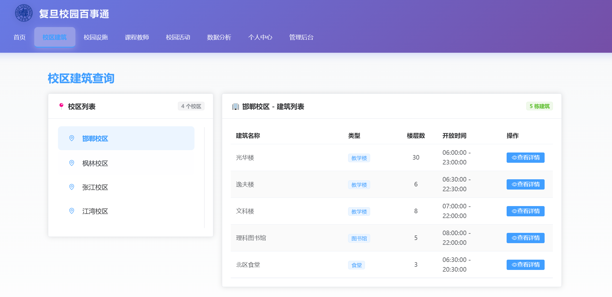
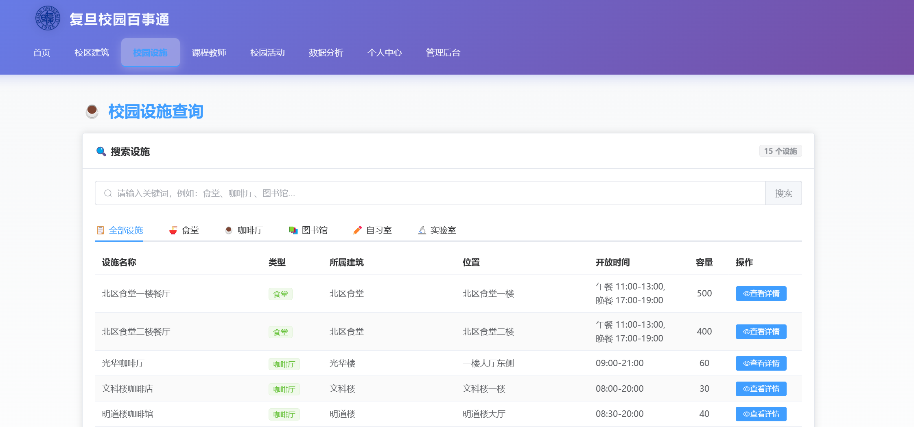
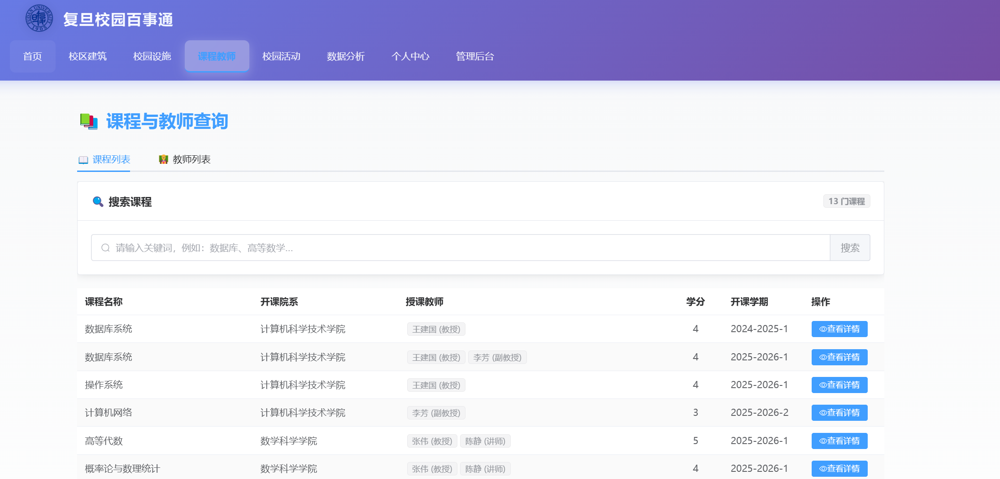
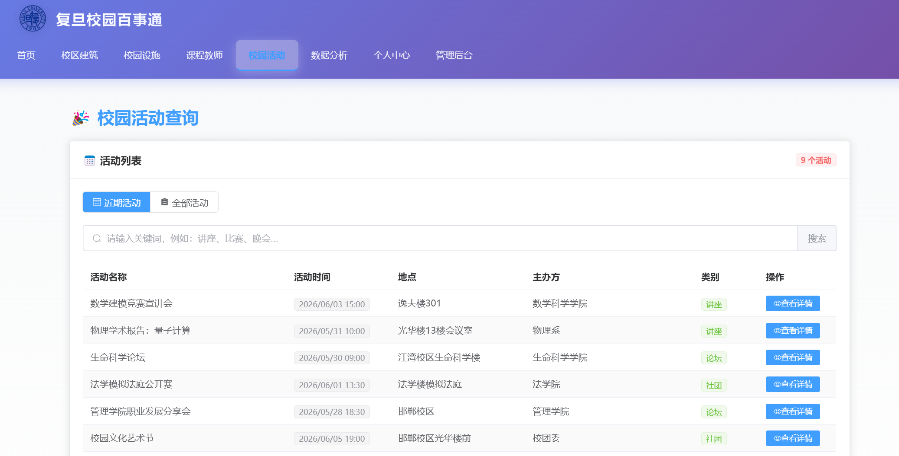
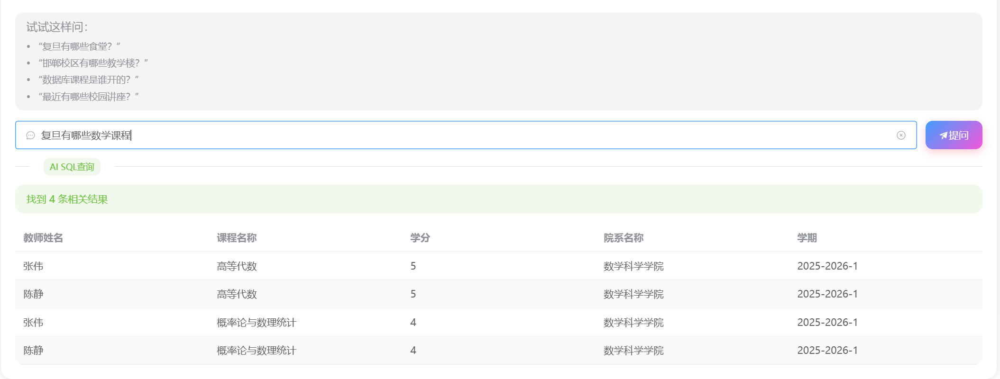
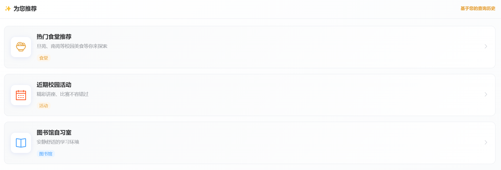
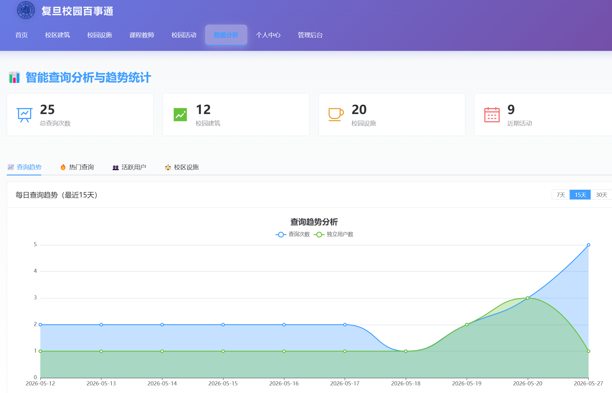
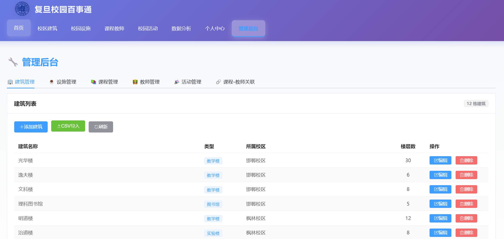

# 复旦校园百事通问答系统 - 主要功能实现结果及阶段演示说明

**项目名称**：复旦校园百事通问答系统  
**小组成员**：洪东浩、马天行  
**提交日期**：2026年5月27日  
**GitHub仓库**：https://github.com/hdh-fall/Fudan-Campus-Info-System

---

## 一、项目概述

本项目是一个以数据库为核心的校园信息问答系统，实现了从基础数据管理到AI智能问答、个性化推荐的完整功能体系。系统采用前后端分离架构，前端使用Vue 3 + Element Plus，后端使用Spring Boot 4.x + Spring Data JPA，数据库采用MySQL 8.0。

### 技术栈

| 层级 | 技术选型 |
|------|---------|
| **前端** | Vue 3 + Element Plus + Axios |
| **后端** | Spring Boot 4.0.6 + Spring Data JPA |
| **数据库** | MySQL 8.0 |
| **AI集成** | 通义千问API（NL2SQL） |

---

## 二、核心功能实现结果

### 1. AI智能问答系统

#### 功能描述
支持用户通过自然语言提问，系统自动理解意图并生成SQL查询，返回结构化结果。

#### 实现要点
- **语义理解**：基于通义千问大模型，将自然语言转换为SQL查询
- **类别识别**：自动识别10种查询类别（食堂、咖啡厅、图书馆、自习室、实验室、建筑、校区、课程、教师、活动）
- **智能降级**：AI服务不可用时自动切换到规则匹配模式
- **中文映射**：数据库字段名自动转换为中文显示
- **时间格式化**：时间字段格式化为友好格式

#### 示例查询
```
用户输入："复旦有哪些食堂？"
→ AI识别类别：FACILITY_CANTEEN
→ 生成SQL：SELECT * FROM facility WHERE type = '食堂'
→ 返回结果：旦苑食堂、南苑食堂、北苑食堂...

用户输入："数学课程有哪些？"
→ AI识别类别：COURSE
→ 语义扩展：匹配包含"数学"或相关学科的课程
→ 返回结果：高等代数、线性代数、数学分析...
```

#### 技术亮点
- ✅ 支持复杂语义理解（如"哪里可以学习" → 自习室推荐）
- ✅ 同名课程区分（同一课程不同学期分别显示）
- ✅ 自动列名映射（`course_name` → "课程名称"）
- ✅ 查询历史记录（标记`used_nl2sql = TRUE`）

---

### 2. 个性化推荐系统

#### 功能描述
基于用户查询历史，智能生成个性化推荐内容，点击后精准跳转到对应的筛选列表。

#### 实现要点
- **推荐算法**：统计用户最近10条查询记录的类别频率，取前3个高频类别
- **全类别覆盖**：支持10种查询类别的个性化推荐
- **精准跳转**：通过`sessionStorage`传递导航参数，目标页面自动切换tab或执行搜索
- **动态更新**：推荐内容随用户行为实时调整
- **降级策略**：无查询记录时返回默认热门推荐

#### 推荐配置表

| 类别 | 图标 | 颜色 | 标题 | 描述 | 跳转目标 |
|------|------|------|------|------|----------|
| FACILITY_CANTEEN | Food | 橙色 | 您可能感兴趣的食堂 | 探索更多校园美食 | facility（食堂tab） |
| FACILITY_CAFE | Coffee | 灰色 | 咖啡厅推荐 | 休闲放松的好去处 | facility（咖啡厅tab） |
| FACILITY_LIBRARY | Reading | 蓝色 | 图书馆推荐 | 安静的阅读和学习空间 | facility（阅览室tab） |
| FACILITY_STUDY_ROOM | Notebook | 绿色 | 自习室推荐 | 舒适的学习环境 | facility（自习室tab） |
| FACILITY_LAB | Monitor | 紫色 | 实验室推荐 | 探索科技创新空间 | facility（实验室tab） |
| BUILDING | OfficeBuilding | 绿色 | 校园建筑探索 | 了解复旦各校区建筑 | campus |
| CAMPUS | MapLocation | 红色 | 校区信息查询 | 探索复旦多个校区的风采 | campus |
| COURSE | Collection | 紫色 | 课程推荐 | 发现优质课程资源 | course |
| TEACHER | User | 青色 | 教师信息查询 | 了解授课教师信息 | course |
| EVENT | Calendar | 橙色 | 校园活动 | 精彩活动不错过 | event |

#### 技术亮点
- ✅ 基于频率统计的智能推荐算法
- ✅ 中文类别映射（兼容旧数据格式）
- ✅ 视觉化展示（专属图标、颜色、标签）
- ✅ 无缝跳转体验（无多余提示消息）

---

### 3. 数据分析与可视化

#### 功能描述
提供查询趋势图表、热门类别排行、活跃用户统计等数据分析功能。

#### 实现要点
- **视图（Views）**：5个预定义视图支撑数据分析
  - `v_popular_query_categories`：热门查询类别统计
  - `v_daily_query_trend`：每日查询趋势
  - `v_active_users`：活跃用户排行
  - `v_campus_facility_popularity`：校区设施热度
  - `v_course_popularity`：课程受欢迎程度

- **存储过程（Stored Procedures）**：
  - `sp_update_query_statistics`：使用游标更新统计缓存
  - `sp_get_personalized_recommendations`：个性化活动推荐

- **触发器（Triggers）**：
  - `trg_after_query_insert`：查询记录插入后自动更新统计

- **事件调度器（Events）**：
  - `evt_daily_statistics_update`：每日凌晨自动刷新统计数据

#### 技术亮点
- ✅ 数据库层封装，应用层无需重复计算
- ✅ 自动维护统计缓存，提升查询性能
- ✅ 支持多维度数据分析（时间、类别、用户）

---

### 4. 校园信息查询系统

#### 功能模块
1. **校区建筑查询**
   - 按校区查看建筑列表
   - 查看建筑详细信息（类型、楼层、开放时间等）
   - 查看建筑内的设施信息

2. **校园设施查询**
   - 按类型浏览设施（食堂、咖啡厅、图书馆、自习室、实验室等）
   - 关键词搜索设施
   - 查看设施详细信息（位置、开放时间、容量等）
   - **精细化分类**：图书馆、自习室、实验室独立分类

3. **课程与教师查询**
   - 浏览所有课程信息
   - 按院系查看课程
   - 关键词搜索课程
   - 查看所有教师信息
   - 查询教师授课情况
   - **同名课程区分**：同一课程不同开课学期分别显示

4. **校园活动查询**
   - 查看近期活动
   - 搜索活动名称或主办方
   - 查看活动详细信息（时间、地点、主办方等）

#### 技术亮点
- ✅ 多表连接查询优化
- ✅ 分页加载提升性能
- ✅ CSV批量导入支持
- ✅ 完整的CRUD操作

---

### 5. 个人中心与管理后台

#### 个人中心
- 查看个人信息
- 查看查询历史记录
- 查看热门查询类别统计
- 切换用户（演示用）

#### 管理后台（仅管理员可见）
- 管理建筑信息（增删改、CSV批量导入）
- 管理设施信息（增删改、CSV批量导入）
- 管理课程信息（增删改、CSV批量导入）
- 管理教师信息（增删改、CSV批量导入）
- 管理活动信息（增删改、CSV批量导入）

#### 技术亮点
- ✅ 角色权限控制（ENUM('user','admin')）
- ✅ 文件上传与解析（CSV导入）
- ✅ 数据验证与错误提示

---

## 三、数据库设计成果

### 1. 表结构设计

系统包含**11张核心表**，符合第三范式（3NF）：

| 序号 | 表名 | 说明 | 记录数 |
|------|------|------|--------|
| 1 | `department` | 院系表 | 10+ |
| 2 | `user` | 用户表 | 5+ |
| 3 | `campus` | 校区表 | 4 |
| 4 | `building` | 建筑表 | 20+ |
| 5 | `facility` | 设施表 | 30+ |
| 6 | `teacher` | 教师表 | 15+ |
| 7 | `course` | 课程表 | 25+ |
| 8 | `course_teacher` | 课程-教师授课关系表 | 40+ |
| 9 | `event` | 活动表 | 10+ |
| 10 | `query_record` | 查询记录表 | 动态增长 |
| 11 | `query_statistics_cache` | 查询统计缓存表 | 动态增长 |

### 2. 约束设计

- **主键约束**：所有表都有主键
- **外键约束**：保证引用完整性（RESTRICT/CASCADE/SET NULL）
- **唯一约束**：用户名、院系名、校区名、统计日期+类别组合等
- **检查约束**：学分范围、年级格式、经纬度范围等
- **非空约束**：关键字段不允许为空

### 3. 索引优化

创建**11个索引**覆盖常用查询字段：
- `building(campus_id)`：加速按校区查建筑
- `facility(building_id)`：加速按建筑查设施
- `course(department_id)`：加速按院系列课程
- `teacher(department_id)`：加速按院系列教师
- `event(event_time)`：加速按时间查询近期活动
- `query_record(user_id, query_time)`：加速按用户查历史记录
- `course_teacher(teacher_id)`：加速查某教师的授课课程
- `query_record(category)`：加速热门查询类别的聚合统计
- `query_record(query_time)`：加速按时间范围的查询趋势分析
- `event(category, event_time)`：加速活动类别与时间的复合查询
- `query_statistics_cache(stat_date)`：加速按日期范围的统计趋势查询

---

## 四、阶段演示说明
`注：演示所用数据均为AI生成`

### 阶段一：基础信息查询

- **校区建筑**：4个校区、若干栋建筑，支持按校区筛选和建筑详情查看


- **校园设施**：6个分类Tab（食堂、咖啡厅、阅览室、自习室、实验室等），20条设施记录，支持分类筛选和关键词搜索


- **课程教师**：25+门课程、15+位教师，同名课程按学期区分显示，教师授课关系通过多对多中间表查询


- **校园活动**：10+条活动记录，支持按名称/主办方搜索

### 阶段二：AI智能问答


- **自然语言查询**：输入自然语言问题，AI自动生成SQL并返回结构化结果，列名自动中文化
- **语义扩展**：支持学科语义扩展（如"数学课程"匹配高等代数、线性代数等）
- **类别识别**：自动识别10种查询类别（图书馆、自习室、实验室独立分类）
- **智能降级**：AI不可用时自动切换规则匹配，保证可用性

### 阶段三：个性化推荐


- **智能推荐**：基于用户最近10条查询记录的类别频率，取前3个高频类别生成推荐
- **精准跳转**：点击推荐卡片直接跳转到对应Tab（如食堂推荐→设施页食堂Tab）
- **全类别覆盖**：10种查询类别均有专属图标、颜色和推荐内容
- **数据兼容**：中英文类别自动映射，兼容历史数据

### 阶段四：数据分析


- **查询趋势**：折线图展示每日查询次数变化
- **热门类别**：柱状图展示各类别查询排名
- **活跃用户**：用户查询次数和探索类别数排行
- **实时更新**：触发器自动维护统计缓存，数据实时刷新

### 阶段五：管理后台


- **权限控制**：基于ENUM角色字段，管理员可见后台入口
- **CRUD操作**：建筑、设施、课程、教师、活动5类数据的增删改
- **CSV导入**：批量导入数据，约束校验拦截非法数据
- **数据验证**：CHECK约束（学分范围）、外键约束（RESTRICT/CASCADE）均生效

---

## 五、项目成果总结

### 1. 完成的功能模块

✅ **AI智能问答系统**：自然语言理解、SQL生成、类别识别、智能降级  
✅ **个性化推荐系统**：基于历史的推荐、全类别覆盖、精准跳转  
✅ **数据分析与可视化**：查询趋势、热门类别、活跃用户、校区设施分布  
✅ **校园信息查询**：校区建筑、校园设施、课程教师、校园活动  
✅ **个人中心**：信息查询、历史记录、热门统计、用户切换  
✅ **管理后台**：数据管理、CSV导入、权限控制  

### 2. 数据库设计成果

✅ **11张核心表**：符合第三范式，结构清晰  
✅ **丰富的约束**：主键、外键、唯一、检查、非空  
✅ **11个索引**：覆盖常用查询字段，性能优异  
✅ **分析增强**：5个视图、2个存储过程、1个触发器、1个事件  

### 3. 技术亮点

✅ **AI集成**：通义千问API集成，NL2SQL实现  
✅ **推荐算法**：基于频率统计的智能推荐  
✅ **数据兼容**：中英文类别映射，兼容旧数据  
✅ **性能优化**：索引优化、视图封装、缓存机制  
✅ **可靠保障**：自动降级、数据验证、错误处理