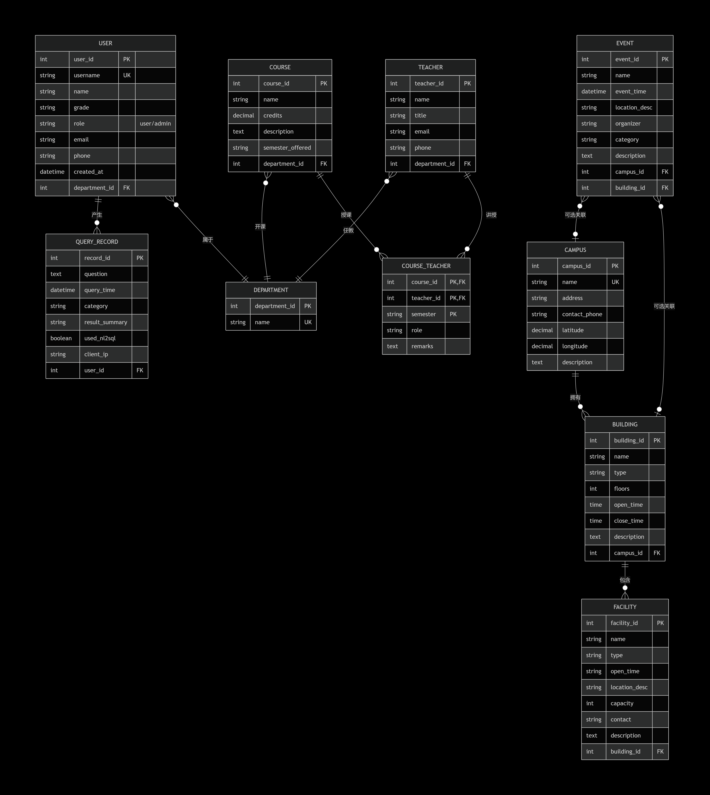

# 复旦校园百事通问答系统  
## 第一阶段报告：需求分析与概念设计

**小组成员**：洪东浩、马天行
**提交日期**：2026年4月1日  

---

## 一、项目选题

本项目基于课程提供的“复旦校园百事通”场景，设计并实现一个以数据库为核心的校园信息问答系统。系统允许用户通过关键词或自然语言查询校园建筑、设施、课程、活动等信息，并记录查询历史，为后续智能问答提供数据基础。选题符合课程对数据库设计完整性的要求，包含明确的实体、关系及约束，至少包含 5 张表、一对多关系、多对多关系及主外键约束。

---

## 二、需求分析

### 2.1 用户角色

| 角色 | 描述 |
|------|------|
| 普通用户 | 已登录用户，可查看个人信息、查询校园信息、查看历史记录 |
| 系统管理员 | 管理基础数据（校区、建筑、设施、课程、教师、活动），支持增删改及批量导入 |

### 2.2 核心功能

- **用户管理**：用户信息查看（演示时支持身份切换）  
- **校园信息搜索与浏览**：  
  - 按校区查看建筑列表  
  - 查看建筑详情及其中设施  
  - 按关键词查询课程、活动  
  - 查看教师授课情况  
- **问答记录管理**：记录用户问题、查询时间、类别，支持历史查看与热门统计  
- **管理员后台**：基础数据维护，CSV 批量导入  

---

## 三、核心数据项与业务对象

根据需求，初步识别以下实体：

| 实体 | 核心属性（部分） |
|------|------------------|
| 用户 | 用户ID、姓名、年级、所属院系、角色、邮箱、电话 |
| 院系 | 院系ID、院系名称 |
| 校区 | 校区ID、校区名称、地址、联系电话 |
| 建筑 | 建筑ID、建筑名称、类型、所属校区ID |
| 设施 | 设施ID、设施名称、类型、开放时间、位置描述、所属建筑ID |
| 课程 | 课程ID、课程名称、开课院系、学分 |
| 教师 | 教师ID、教师姓名、所属院系、职称 |
| 活动 | 活动ID、活动名称、举办时间、地点、主办单位 |
| 查询记录 | 记录ID、用户ID、问题内容、查询时间、类别 |

---

## 四、实体间关系

| 关系类型 | 实体A | 实体B | 说明 |
|----------|-------|-------|------|
| 一对多 | 校区 | 建筑 | 一个校区包含多个建筑 |
| 一对多 | 建筑 | 设施 | 一个建筑内包含多个设施 |
| 多对多 | 课程 | 教师 | 一门课可由多位教师授课，一位教师可授多门课（需中间表） |
| 一对多 | 用户 | 查询记录 | 一个用户有多条查询记录 |
| 多对一 | 用户 | 院系 | 用户属于一个院系 |
| 多对一 | 教师 | 院系 | 教师属于一个院系 |
| 多对一 | 课程 | 院系 | 课程由某个院系开设 |
| 可选关联 | 活动 | 校区或建筑 | 活动可关联到校区或建筑（可为空） |

> 多对多关系“课程-教师”在关系模式设计中通过中间表 `course_teacher` 实现，并包含学期属性。

---

## 五、ER 图

**图注**：  
- 实体的主键用 `PK` 标注，外键用 `FK` 标注。  
- `COURSE_TEACHER` 为多对多关系的中间表，使用复合主键 `(course_id, teacher_id, semester)`。  
- `EVENT` 可选关联校区或建筑，外键可为空。  
- `DEPARTMENT` 独立存在，被用户、教师、课程引用，消除了院系名的冗余。